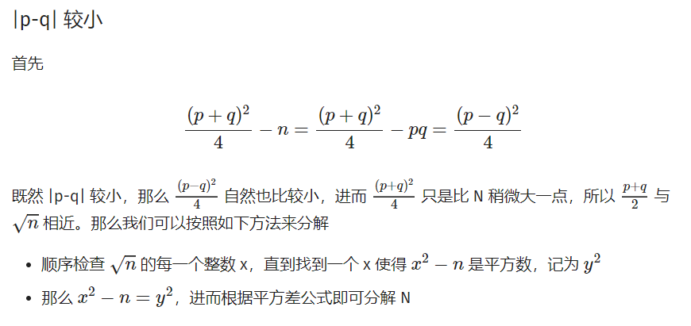

## RSA-Generator_WP

#### #0x00#

先看一下刘老师题目的源码

```
def generate_public_key():
    part1 = 754000048691689305453579906499719865997162108647179376656384000000000000001232324121
    part1bits = part1.bit_length()
    lastbits = 512 - part1.bit_length()
    part1 = part1 << lastbits
    part2 = random.randrange(1, 2**lastbits)
    p = part1 + part2
    while not gmpy2.is_prime(p):
        p = part1 + random.randrange(1, 2**lastbits)
    q = getPrime(512)
    n = p * q
    print p
    print q
```

p，q的产生过程

part1转化为二进制数，一共有279位，也就是最终的p的前279位就是part1，后面233位是随机产生的

q是随机产生的512位bit的 数

#### #0x01#

开始我想的是ctf-wiki上的这个方法



后来试了好久，发现行不通，然后这时候刘师傅放出了第一个hint，已知p的高位攻击

#### #0x02#

网上找到一个1024bit p的脚本

[参考exp](https://weibo.com/ttarticle/p/show?id=2309404195295486431303&infeed=1)

改一下，最终版本如下

```
n = 0x639386F4941D1511D89A9D19DC4731188D3F4D2D04623FB26F5A85BB3A54747BCBADCDBD8E4A75747DB4072A90F62DCA08F11AC276D7588042BEFA504DCD87CD3B0810F1CB28168A53F9196CDAF9FD1D12DCD4C375EB68B67A8EFCCEC605C57C736943170FEF177175F696A0F6123B993E56FFBF1B62435F728A0BAC018D0113


cipher = 0x56c5afbc956157241f2d4ea90fd24ad58d788ca1fa2fddb9084197cfc526386d223f88be38ec2e1820c419cb3dad133c158d4b004ae0943b790f0719b40e58007ba730346943884ddc36467e876ca7a3afb0e5a10127d18e3080edc18f9fbe590457352dca398b61eff93eec745c0e49de20bba1dd77df6de86052ffff41247d


e2 = 0x10001
pbits = 512
for i in range(0,4096):
  p4 = 0x635c3782d43a73d70465979599f65622c7b4242a2d623459337100000000004973c619000
  p4=p4+int(hex(i),16)
  print hex(p4)
  kbits = pbits - p4.nbits()  #未知需要爆破的比特位数
  print p4.nbits()
  p4 = p4 << kbits
  PR.<x> = PolynomialRing(Zmod(n))
  f = x + p4
  roots = f.small_roots(X=2^kbits, beta=0.4) #进行爆破
  #rint roots
  if roots:        #爆破成功，求根
    p = p4+int(roots[0])
    print "p: ", hex(int(p))
    assert n % p == 0
    q = n/int(p)
    print "q: ", hex(int(q))
    print gcd(p,q)
    phin = (p-1)*(q-1)
    print gcd(e2,phin)
    d = inverse_mod(e2,phin)
    flag = pow(cipher,d,n)
    flag = hex(int(flag))[2:-1]
    print binascii.unhexlify(flag)
```

一开始不清楚512bit的p需要已知多少bit才能攻击，就很迷，直接上发现不行，就开始加bit位

十六进制每个字符占4bit，后来刘师傅的第二个hint也说了10位左右，我这个是12bit，就是3位十六进制

在p4(也就是part1)后面加上3个0，三位十六进制数范围在0~2**12(4096)之间

```
for i in range(0,4096)
```

爆破这三位，然后进行高位攻击，求出p,q，之后解出flag

```
p:  0xc6b86f05a874e7ae08cb2f2b33ecac458f6848545ac468b266e2000000000092e78c32598fb5c1f4c90d4b83cbd028af0316621aeba6de9d6ce12408e2561defL
q:  0x804740ca0f7fa52fd94c9f3854c52654ebcc833f4b2b6f26e5f8d9b3707a21394025d7a5c2e1bddd15cc488f3f01106cf04498f6e2c1ba418795ad8e6c7b331dL
1
1
xman{RSA-is-fun???!!!!}
```

